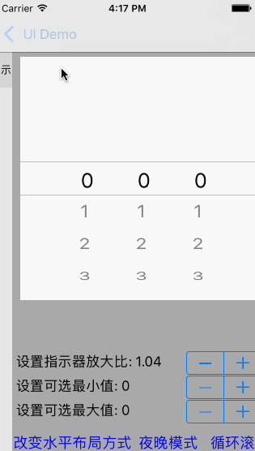

# DLPickerView

 `DLPickerView` 的用法和 `UIPickerView` 完全一样，可以用它来替代 `UIPickerView`。除了和 `UIPickerView` 类似的用法之外，`DLPickerView` 更易于自定义，并且有很多 `UIPickerView` 没有的特性。换句话说，**我重新实现了 `UIPickerView`** 。

<p align="center"></p>

# 特性

 `DLPickerView` 有如下这些 `UIPickerView` 没有的特性：
 
1. 可以配置某个 component 循环滚动。原生的 `UIPickerView` 的循环滚动的实现是通过设置一个很大的 row 个数给你想要的 component，所以当你一直滑的时候，其实是可以滑到底的。但是 `DLPickerView` 是纯粹的无限循环滚动。
2. 可以配置某个 component 可以滚动的区域。用户无法滚动到设置的区域外面。
3. component 的布局可以不仅仅是水平排列的，也可以是垂直排列的。
4. `DLPickerView` 的使用方式可以像 `UITableView` 一样。只需要继承 `DLPickerViewCell` 实现自定义的 cell ，每个 cell 都是复用的。
5. 可以配置滚轮滚动的音效，还可以将音效关闭。
6. 可以配置滚轮滚动的效果，也就是滚轮可以滚动的不只是类似原生的“滚轮”效果。并且可以基于 cell 的位置，设置每个 cell 的视觉效果。
7. 原生的 `UIPickerView` 中间有一种放大镜的效果，在 `DLPickerView` 中可以设置放大的比例。
8. 可以配置夜间模式。
9. 可以配置无限滚动的 component（也就是无限大的 row 个数大小），同时内存使用是极小的。
10. 如果你有其他任何想法，可以提个 issue 给我。


# 使用建议
 
 1. 如果更改了 `DLPickerView` 的一些视觉相关的属性，需要确保调用 `reloadComponent` 或者 `reloadAllComponent`。
 2. 为一个 component 的每个 row 设置不同的高度，最好将 `showsSelectionIndicator` 设置成 false，因为这样设置视觉效果会更好。
 3. 给每个 component 设置自定义的指示器还没有开发完成。
 4. 添加 `DLPickerView` 到  `ViewController` 的 view 中的时候，有时候需要设置 `automaticallyAdjustsScrollViewInsets` 为 false。
 5. 虽然 `DLPickerView` 是使用 swift 开发的，但是同时也可以实用在 oc 的项目中。
 6. 很高兴如果有人反馈 bug 给我。

# `DLPickerView` 是如何实现的

在代码中可以发现， `DLPickerView` 是基于 `DLTableView` 开发的。是的，为了实现  `DLPickerView`，我基于 `UIScrollView` 重新实现了一个 `UITableView`，也就是 `DLTableView`。`DLTableView` 还不完全支持 `UITableView` 的 API，并且 `DLTableView` 没有 section 头和尾。 但是 `DLTableView` 也有很多 `UITableView` 没有的特性。而且我也认为 `DLTableView` 可以被用在大部分的情景下。如果感兴趣的话，可以查看相应代码。同时我也会继续改进 `DLTableView`，在让它的使用方式是 `UITableView` 类似的同时，加更多有用的 `UITableView` 不具备的特性。

基于 `DLTableView` 实现 `DLPickerView` 非常的简单，只需要配置每个 component 为一个 `DLTableView` 就好了。

## 使用要求

需要 Xcode 8.0+ 和 Swift 3.x。
同时工程 target 需要最低 `iOS 8.0+`

## 使用方式

手动添加 [`DLPickerView`](https://github.com/danleechina/DLPickerView/tree/master/DLPickerView/DLPickerView) 到工程中。因为是使用 Swift 开发的，所以使用 Objective C 的开发者需要给工程添加相应的 bridge file。


## 用法

Clone 这个 repo. 点击 `DLPickerView.xcodeproj` 文件启动 `Xcode`。

```
let cyclePickerView = DLPickerView()
cyclePickerView.delegate = self
cyclePickerView.dataSource = self
cyclePickerView.frame = CGRect(x: 10, y: 70, width: self.view.frame.width - 20, height: self.view.frame.width - 20)
cyclePickerView.reloadAllComponents()
self.view.addSubview(cyclePickerView)

```

你需要实现 `DLPickerViewDataSource` 和 `DLPickerViewDelegate`

1. `DLPickerViewDataSource` 和 `DLPickerViewDataSource ` 类似。
2. `DLPickerViewDelegate` 有所有 `UIPickerViewDelegate` 提供的方法。同时也有很多 `UIPickerViewDelegate` 没有的方法。在每个协议前我写了很多注释，在使用之前最好阅读这些注释。如果你想要一个不同的 picker view 的话，最好看一下这些协议。
3. `DLPickerView` 的公开属性和公开方法和 `UIPickerView` 完全一致，同时也添加了一些其他属性、方法。


## 贡献者

作者: [@粉碎音箱的音乐(weibo)](http://weibo.com/u/1172595722) 

Blog: [Blog](http://danleechina.github.io/)

## 需要 Star！

如果你觉得 `DLPickerView` 有用的话，请点个 star 呗！谢谢啦。😄

